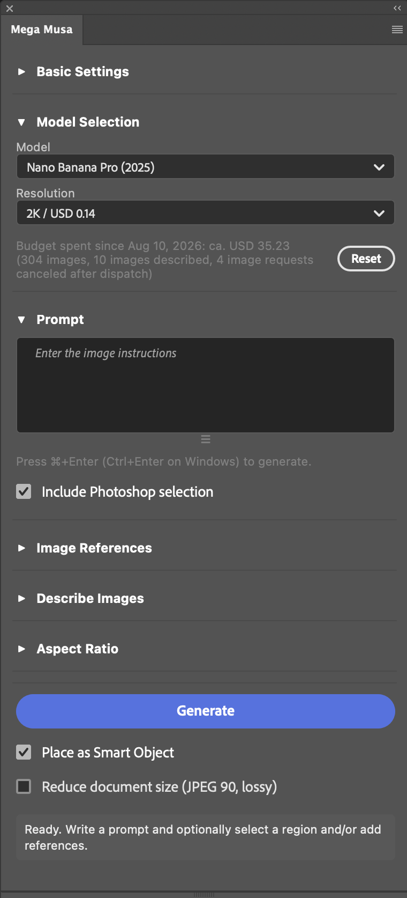

# Mega Musa — AI images in Photoshop

Generate images and edit selections with Google Gemini (Nano Banana) and OpenAI GPT Image models.

## Features

- **Generate and edit:** work on a selection, the full document or the active artboard. Place results as Smart Objects or raster layers, with editable selection masks.
- **Choose a model:** Nano Banana Pro, Nano Banana 2, OpenAI Sunburst, OpenAI Flare or OpenAI GPT Image 2. Resolution and quality settings are saved per model. For OpenAI models, enable **Transparent background** below Quality and also request transparency in your prompt. Results may vary. Leave it unchecked to request an opaque background. This setting is also saved per model.
- **Use image references:** add up to 10 PNG, JPEG or WebP images by file picker, drag and drop or paste. **Describe Images** turns input images into a prompt.
- **Generate variations:** queue jobs or expand one prompt into a batch of up to 10 images. Cancel jobs individually or with **Cancel All**.
- **Reuse results:** recall prompts, settings and embedded references from generated layers. Track estimated API spending in your preferred currency.

 

## Install

1. Install the [Adobe Creative Cloud desktop app](https://www.adobe.com/creativecloud/desktop-app.html) and sign in.
2. Use Creative Cloud to install Photoshop 27.4 or later.
3. Download the `.ccx` file under **Assets** from the [latest release](https://github.com/SphericalLabs/mega-musa/releases/latest).
4. Double-click the `.ccx` file. Follow the Creative Cloud prompts to install the plugin.
5. Open Photoshop. Open Mega Musa from the **Plugins** menu.

To build from source, see [DEVELOPER.md](DEVELOPER.md#build-and-load).

### Troubleshooting (macOS)

**The downloaded plugin cannot be opened:** right-click the `.ccx` file, choose **Open With → Other…** and select **UnifiedPluginInstallerAgent**. You can find it at `/Library/Application Support/Adobe/Adobe Desktop Common/RemoteComponents/UPI/UnifiedPluginInstallerAgent/`.

**Adobe Creative Cloud shows error code `2` or `-2`:** open **System Settings → Privacy & Security → Full Disk Access** and grant access to Adobe Creative Cloud and the Adobe component in `/Library/Application Support/Adobe/Adobe Desktop Common/ADS/`.

## Use

1. Under **API Keys / Currency**, enter and save the Gemini or OpenAI API key for your selected model.
2. Open a document. Select an area to edit, or clear the selection to use the full document or active artboard.
3. Enter a prompt. Add references if needed. To create a prompt from input images, open **Describe Images** and click **Describe**. This replaces the current prompt.
4. Choose the model, resolution and quality. Click **Generate**, or press **Cmd+Enter** on macOS or **Ctrl+Enter** on Windows.

### Selection and placement

**Include Photoshop selection** sends the visible canvas pixels to the model. Clear it to generate from the prompt and references only. Your selection still controls placement and masking.

Select enough surrounding image for the model to blend the edit. Feather the selection for a soft edge. Hide a previous result before generating again if you do not want it included in the input.

Generation preserves your entire selection, full canvas or active artboard. Canvas input includes surrounding context to match a supported aspect ratio, with transparent padding outside the target. Results scale proportionally to fill the original rectangle and hide excess edges with an editable mask. **Fit Selection** explicitly changes the selection to the ratio in the menu. **Fit to Nearest Aspect Ratio** uses the closest supported ratio.

Results appear above all groups and artboards in the original document. **Place as Smart Object** is on by default and preserves the full output resolution for later resizing. Clear it for raster layers. If Smart Object placement fails, the plugin keeps the result as a raster layer.

Pixel layers retain the complete scaled image. Both pixel layers and Smart Objects use an editable mask for nonrectangular or feathered selections and when the image extends beyond the destination, including outside the canvas. An opaque rectangle needs no mask only when the complete image fits it exactly. Masks preserve captured selection coverage and are linked to the image, so both move and scale together. Unlink the mask to move the image inside a fixed boundary. If mask creation fails, placement pauses for Retry Placement without cropping pixels or baking the mask into transparency. Placement preserves the current Photoshop selection, including changes you make while a generation is running. To paint on a Smart Object, open its contents or rasterize it first.

### Queue and prompt expansion

Each job keeps the prompt, settings, references, canvas pixels and destination captured when you click **Generate**. You can edit the controls while jobs run. Standard clicks allow up to four active jobs; two provider requests run at a time.

Brace groups create variations:

| Prompt | Result |
| --- | --- |
| `a {red, blue} {balloon, car}` | Four prompts: one for each combination |
| `{a photo of a {banana, strawberry}, 3}` | Three banana prompts and three strawberry prompts |

One batch can contain up to 10 images. Invalid expressions or larger batches queue nothing. Use `\{`, `\}`, `\,` and `\\` for literal characters inside a group.

Canceling a job before its request is sent costs nothing. Requests already sent can still be billed. Once a result arrives, the plugin finishes placing it. Failed jobs show an error in their queue row.

### Recall a generation

Select a generated layer to open **Recall Generations**. **Copy Prompt** copies its prompt. **Load Settings** restores its prompt, model settings and available references. Global placement and file-size preferences stay as set.

**Restore Rectangle** restores the saved selection bounds, or the generation frame if there was no selection. It does not restore the selection shape, feathering or source pixels. Changed document or artboard geometry can block restoration. Check the rectangle before generating.

### Document structure and file size

Result layers store their prompt and settings. References are reused from the hidden, locked **Mega Musa Reference Archive** group. **Reduce document size (JPEG 90, lossy)** is off by default. Enable it to compress new opaque Smart Object sources and references; transparent assets use lossless PNG. Existing references stay unchanged. Keep the archive group to preserve reference recall.

### Color and document limits

Model inputs and outputs use 8-bit sRGB. The plugin warns about precision loss in 16-bit documents and color conversion where needed. Generation is blocked in 32-bit/HDR documents, Quick Mask mode and Bitmap, Indexed Color, Duotone or Multichannel modes. Follow the panel message to use a supported document state.

### Spending and currency

The local spending total includes generation and Describe. It is an estimate of API charges. Choose **Display currency** under **API Keys / Currency**. Rates refresh in the background; offline use keeps cached rates or shows USD. **Reset** clears spending and image counts.

## Privacy

API keys use UXP secure storage. Prompts and images go directly to the selected provider. The project has no server that receives them. Currency lookups send only currency codes to Frankfurter.

Provider retention depends on your API account and its settings. See [Gemini data retention](https://ai.google.dev/gemini-api/docs/zdr) and [OpenAI data controls](https://developers.openai.com/api/docs/guides/your-data).

## Development and license

See [DEVELOPER.md](DEVELOPER.md) for builds, checks and extensions. See [ARCHITECTURE.md](ARCHITECTURE.md) for module boundaries and behavior that changes must preserve.

Licensed under [GPL version 3 only](LICENSE) with a [Photoshop/UXP linking exception](LICENSE-EXCEPTION).

SPDX: `GPL-3.0-only WITH GPL-3.0-linking-exception`
