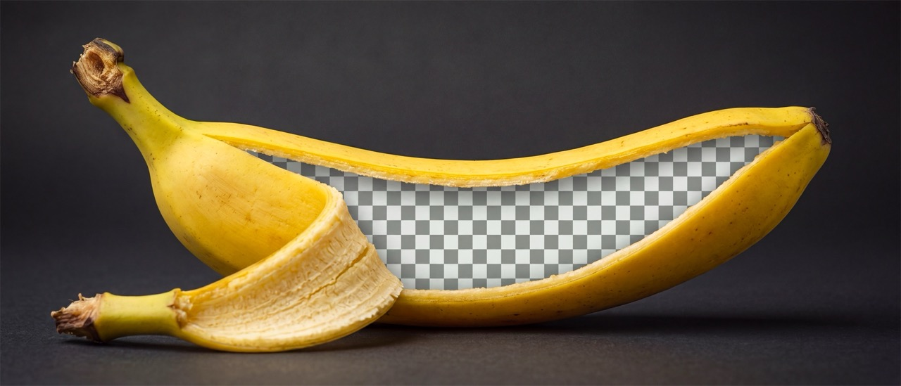

# Mega Musa — Photoshop UXP plugin for Generative AI

*Musa × paradisiaca*

A Photoshop panel for AI image generation and localized editing with Google Gemini image models (Nano Banana) and OpenAI GPT Image models.



## Features

- Edit a selection, the full document or the active artboard. Each result keeps the complete native provider image inside an embedded Smart Object, cover-transformed at the top of the relevant document, artboard or group and named after the prompt with the model, resolution and quality in brackets. Selected regions keep their shape and feathering through a linked, editable layer mask. If Smart Object placement fails, Mega Musa preserves the paid result as a raster layer and reports the fallback.
- Each generated layer stores its complete prompt and generation settings in namespaced Photoshop layer metadata. Selecting the layer shows the archive in Mega Musa, where the prompt can be copied or the controls restored. Stage 1 records reference names but does not embed reference image pixels.
- **Include Photoshop selection** controls whether canvas pixels are sent to the model. When off, generation uses only the prompt and optional references; a selection still controls placement and masking.
- Add up to 10 PNG, JPEG or WebP references by file picker, drag and drop or clipboard paste. References are normalized to sRGB before they are sent.
- Choose Nano Banana Pro, Nano Banana 2 or OpenAI GPT Image 2, then set the selected model's supported resolution, quality and aspect ratio.
- Cancel a running generation from the same button. A request that has already reached the provider counts as billed and is added to the spend counter.
- Track estimated spend locally.

## Requirements

- Adobe Photoshop 24.0+
- Node.js 18+ and npm
- UXP Developer Tool
- A Gemini API key and/or OpenAI API key

Keys are stored in UXP secure storage. Requests go directly to the selected provider. No project server receives your keys or images. See [Data retention](#data-retention) for what the provider keeps.

## Build and load

```bash
npm install
npm run build
```

In UXP Developer Tool, add `dist/manifest.json` and click **Load**. After changes, run `npm run watch` and click **Reload**. Run `npm run typecheck` for a TypeScript check.

## Use

1. Save the API key for the selected provider.
2. Open a Photoshop document. Select a region or leave no selection to use the full image or active artboard.
3. Enter a prompt. Add references if needed.
4. Choose the model and settings, then click **Generate**.

To reuse a generation later, select its result layer in Photoshop's Layers panel. **Archived Generation** appears in Mega Musa without changing the current controls. **Copy Prompt** copies the complete prompt. **Load Settings** explicitly restores the prompt, model, supported controls and embedded reference images. Mega Musa stores each unique reference once as an embedded Smart Object in a locked, eye-off `Mega Musa Reference Archive` group, deduplicated by a SHA-256 hash of its original file bytes. Result layers point to those assets in their per-layer metadata. If an asset was removed or changed, the remaining settings still load and the panel reports the missing reference. Older Stage 1 records remain readable but contain reference names only.

**Generate** becomes **Cancel** for the length of a run. Cancelling before the request is sent costs nothing; cancelling after it has gone out frees the panel but not the bill — the provider generates the image regardless, so the estimate is added to the budget and counted as cancelled. Once the image is back, the button stops offering the cancel: the money is spent, so the result is placed.

Existing selections are framed to the nearest supported output ratio without changing their original shape. Nothing is added around them — the crop is the selection itself, so select as much surrounding image as the model should see to blend into, and feather the selection for a soft edge. When **Include Photoshop selection** is on, the source is Photoshop's visible composite; hide or delete a previous result before rerunning an edit if it should not be included.

Result transforms are nondestructive: scaling down and back up reuses the native pixels stored in the Smart Object, and an unexpected provider ratio retains its hidden overflow for later reframing. Masks are linked by default so the image and mask transform together; unlink the mask first to reframe the image inside a fixed selection boundary. Enlarging beyond the native provider dimensions cannot create new detail. Paint, erase, clone and similar pixel edits require opening the Smart Object contents or rasterizing the result first.

Mega Musa uses 8-bit sRGB for model inputs and outputs. A 16-bit document shows a precision warning. Partial placements in CMYK, Lab, Grayscale and non-sRGB documents show a color-conversion warning, which is skipped when the result fully and opaquely covers the complete document or active artboard. Either warning can be accepted once per exact mode/profile/depth state during the panel session. A 32-bit/HDR document, Quick Mask mode or a Bitmap, Indexed Color, Duotone or Multichannel document blocks generation before anything is sent and explains how to switch to a supported state.

## Data retention

What a provider keeps is set on your API account, not by this plugin. Every endpoint and model used here is eligible for zero data retention (ZDR).

- **Gemini:** on the free tier Google may use your prompts and images to improve its products. Use a project with billing enabled, and [request ZDR](https://ai.google.dev/gemini-api/docs/zdr) for that project if you need it.
- **OpenAI:** inputs are never used for training, and abuse-monitoring logs are kept for 30 days. Ask OpenAI sales about [ZDR](https://developers.openai.com/api/docs/guides/your-data).

Some non-identifying metadata is retained under ZDR either way.

## License

[GNU GPLv3](LICENSE)
